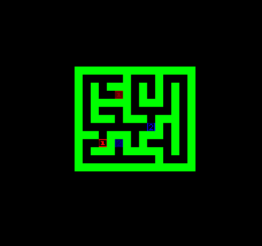

# Dual Maze

Author: Yoseph Mak

Design: This is a puzzle game where you control two icons at the same time. Both of them respond to the same set of inputs, so some thought is required when orienting both icons.

There are 10 levels, roughly increasing in difficulty. Getting both icons to their goal positions immediately takes you to the next level.

Screen Shot:

How Your Asset Pipeline Works:

There are two main parts of the asset pipeline. The first is the pipeline which imports my tiles. [assets/tileset.png](assets/tileset.png) is an image containing all the tiles used in 8x8 squares. The tiles are notably relatively basic, but they get the job done. Using Jude Markabawi's image asset converter (credited below), the tileset is converted into proper tiles and palettes which are .bin files.

The second and more important part is the level assets. Each level is initially developed as a text file, like [assets/level1.txt](assets/level1.txt). This makes sense because the sprites only move along "grid" lines, so any parts of a level can be implemented as a rectangle of characters.

The file [convert_levels.cpp](convert_levels.cpp) converts the text files to my .level asset format. I could've chosen to have all the levels be in a single file, but this method was easier and saves me work when the levels don't store any additional info. Each .level stores the puzzle dimensions, the start and goal positions for each icon, and the entire layout of the puzzle. In [Level.cpp](Level.cpp) there is conversion code for the .level files to and from the actual Level objects which contain all of this information. I don't actually use Level.cpp's functions, but they're there for reference in the files where I do use similar code to get the job done.

Compiling convert_levels.cpp witih the proper dependencies via [Maekfile-converter.js](Maekfile-converter.js) produces dist/convert_levels.exe which (re-)makes the assets when run.

The Level objects are used in [PlayMode.cpp](PlayMode.cpp) where the level layouts are drawn in to the PPU.

How To Play:

Simply use the arrow keys. Both the red and blue icons will move if possible in the direction according to that arrow key. However, if there is a wall (or the other icon!) blocking an icon, the icon will not move. This idea can often be used to realign how far apart the icons are, which is very important to solving a few levels.

If you get stuck, you can press backspace to reset the level.

This game was built with [NEST](NEST.md).

Credits:
- The [course website](http://graphics.cs.cmu.edu/courses/15-466-f24)
- Jude Markabawi for the [tileset asset generator](asset_gen.py)
- Other citations within files are provided when needed.